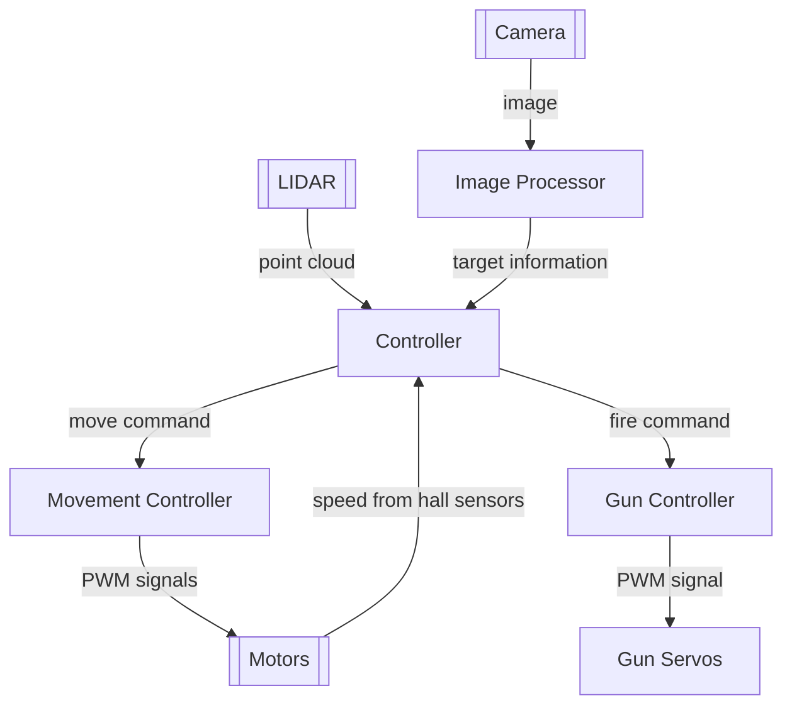
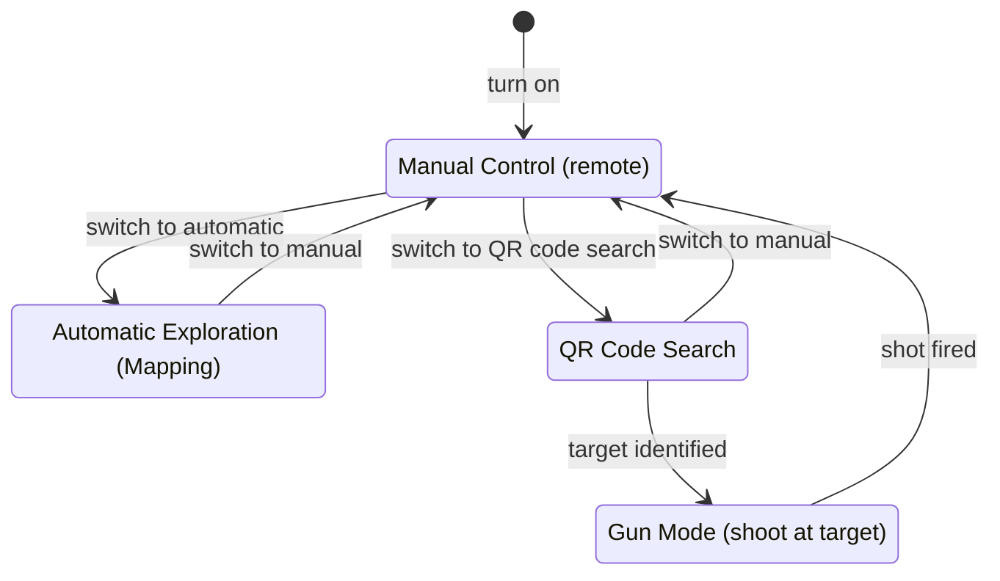

# Mobile Robotics Project 2
An autonomous vehicle with Lidar will be developed as a group project as part of the [FHGR BSc Mobile Robotics](https://fhgr.ch/mr).

## Architecture
### Structure
The software will be roughly structured along these boundaries:


Note that various helper ROS nodes are not (yet) shown here. Only the main components are shown.

When running in a simulator ([gazebo](https://gazebosim.org/)) the movement controller and gun controller will be replaced
by a simulator version thereof which will then interact with gazebo rather than the real hardware.

Convention used (& invented) for this diagram:
* Hardware is rendered like this:
  ```mermaid
  graph TD
      A[[Some Hardware]]
  ```
* Software (each box is a [ROS node](https://wiki.ros.org/Nodes)) is rendered like this:
  ```mermaid
  graph TD
      A[Some Software]
  ```

### State

