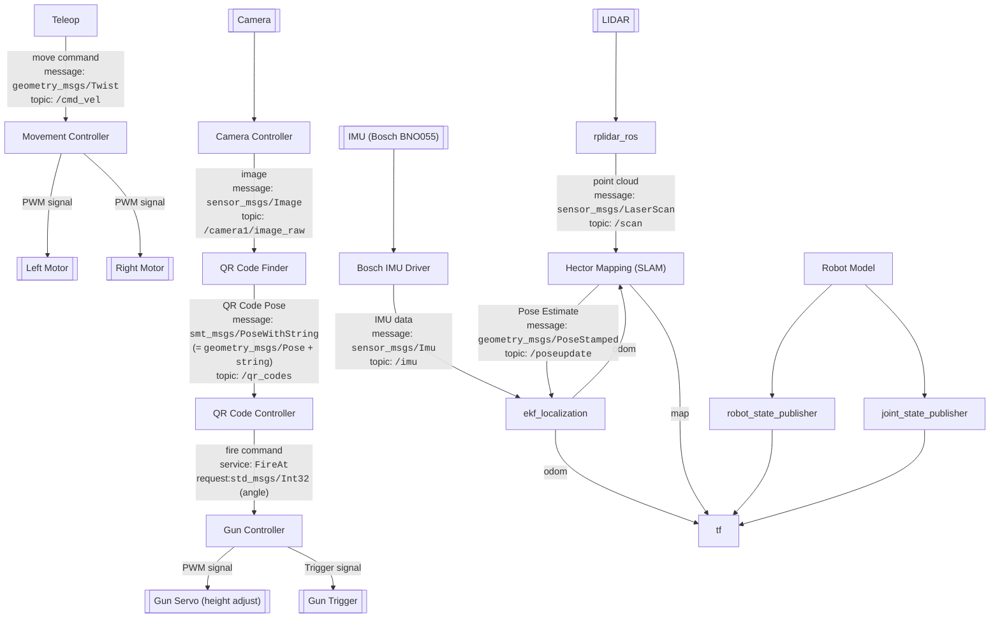
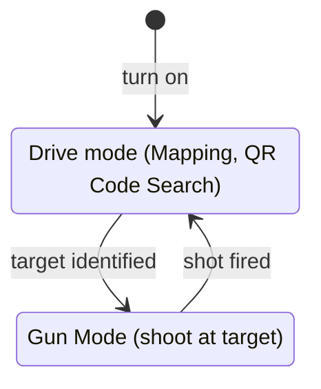

# Mobile Robotics Project 2
[](https://github.com/rursprung/fhgr-mrproj2/actions/workflows/CI.yml)

An autonomous vehicle with Lidar will be developed as a group project by [Tim Barmettler](https://github.com/TimBarmettler4),
[Joel Flepp](https://github.com/joel5399), [Jan Gridling](https://github.com/Prince-Sigvald) and [Ralph Ursprung](https://github.com/rursprung)
as part of the [FHGR BSc Mobile Robotics](https://fhgr.ch/mr).

## Features

The robot can be operated using the keyboard and driven around. While driving, it creates a map of its environment.
In parallel, a camera is used to scan for a QR code and if this is found, the gun will shoot at the QR code.

### GUI

The GUI will likely be developed using rqt. It will include a manual control interface for steering the tank, as well as
several buttons to switch between different modes. To provide a visual representation of the scanned room, the current
live map will be displayed within the GUI. Additionally, the GUI will show the tank's current location, speed, and
direction of movement.

### Mapping

A 2D map is being created using [SLAM](https://en.wikipedia.org/wiki/Simultaneous_localization_and_mapping) and can be
downloaded using [hector_geotiff](https://wiki.ros.org/hector_geotiff). If it is not downloaded, the data will be lost
once the software is stopped / the robot powered down.
Currently, the robot does not support loading a pre-made map and continue mapping in it.

To save the map to [`smt_slam/maps`](smt_slam/maps) run:
```bash
rostopic pub /syscommand std_msgs/String -1 "data: 'savegeiff'"
```

## Architecture

### Structure

The software is structured along these boundaries:



Note that various helper ROS nodes are not shown here. Only the main components are shown.

When running in a simulator ([gazebo](https://gazebosim.org/)) the hardware related controllers will be replaced
with simulator versions thereof, which will then interact with gazebo rather than the real hardware.

Convention used (& invented) for this diagram:

* Hardware is rendered like this:
  ```mermaid
  graph TD
      A[[Some Hardware]]
  ```
* Software (each box is a [ROS node](https://wiki.ros.org/Nodes)) is rendered like this:
  ```mermaid
  graph TD
      A[Some Software]
  ```

### State



## Working With This Repository

As this repository contains code for [ROS](https://ros.org/) (specifically, ROS noetic, the last 1.x release) and uses
the [catkin](https://catkin-tools.readthedocs.io/en/latest/) build tool, you'll need to work in a catkin workspace.

1. Source your ROS setup script (you should preferably add this to your `~/.profile`, esp. if you're working with an
   IDE!)
   ```bash
   source /opt/ros/noetic/setup.bash
   ```
2. Create a new folder for your new catkin workspace (note: you can have multiple catkin workspaces in parallel and also
   source all of their `setup.bash` files at the same time, that works fine):
   ```bash
   cd <wherever you want to have your workspace>
   ```
3. Clone this repository into the workspace and name the folder of the repository `src`:
   ```bash
   git clone --recurse-submodules git@github.com:rursprung/fhgr-mrproj2.git src
   ```
   Notes:
   * If you cloned it without specifying `src` at the end it'll create a folder named after the repository,
     i.e. `fhgr-mrproj2` - just use `mv fhgr-mrproj2 src` to fix this.
   * If you cloned it without specifying `--recurse-submodules` you can still manually init the submodules:
     ```bash
     git submodule init
     git submodule update
     ```
4. Install all required dependencies:
   ```bash
   rosdep install --from-paths . -i

   sudo pip install pynput # see https://github.com/ethz-asl/better_teleop for more details
   ```
5. Build the workspace & source its setup file:
   ```bash
   catkin build
   source devel/setup.bash
   ```
6. Optional: when working with an IDE you should add the sourcing of the `setup.bash` of your workspace also to
   your `~/.profile` (same as the one from ROS) so that it's set for all sessions and your IDE can access it!

### Contributing To The Repository
If you intend to contribute to the repository, please make sure that you're using a fork rather than working directly in the upstream repository!
Follow the guide above to set up your repository and then:
1. Create your fork on GitHub if you haven't done so already
2. Go to your local clone of the repository:
   ```bash
   cd <your workspace>/src
   ```
3. Rename the remote `origin` to `upstream`:
   ```bash
   git remote rename origin upstream
   ```
4. Add your own fork:
   ```bash
   git remote add origin <your fork URL>
   git fetch --all
   ```
5. Follow [the contribution guide](CONTRIBUTING.md) for further details.

### Running The Code
#### Simulation
After building the project you can run the simulated robot using:
```bash
roslaunch smt_launch_gazebo default.launch
```

You can use the arrow keys to navigate in the world.

#### On the Robot
To run the code on the robot you initially need to set up the udev rules for the LIDAR:
```bash
$(rospack find rplidar_ros)/scripts/create_udev_rules.sh
```
This only needs to be done once.


Due to the limited computational power of the Raspberry Pi the compute heavy tasks have been offloaded to a more capable computer (usually a ROS-specific VM running on your notebook). Accordingly, there are two launch packages, one for the robot and one for the remote device (which will also start rviz and teleop).
In order for the two to be able to communicate you need to ensure that they can see each other in the network. Note that for VMs this means that they must have a bridged network adapter instead of NAT so that they have an IP by which they're reachable from the outside. You'll also need to start `roscore` on one of the two and then set the `ROS_MASTER_URI` on the second to the first (check the `roscore` output there for the URL with the port number).
Furthermore it's likely that you need to set the `ROS_IP` and `ROS_HOSTNAME` for things to work properly.

Afterward you can launch the on the robot:
```bash
roslaunch smt_launch_hardware default.launch
```

And on your computer:
```bash
roslaunch smt_launch_remote_control default.launch
```
